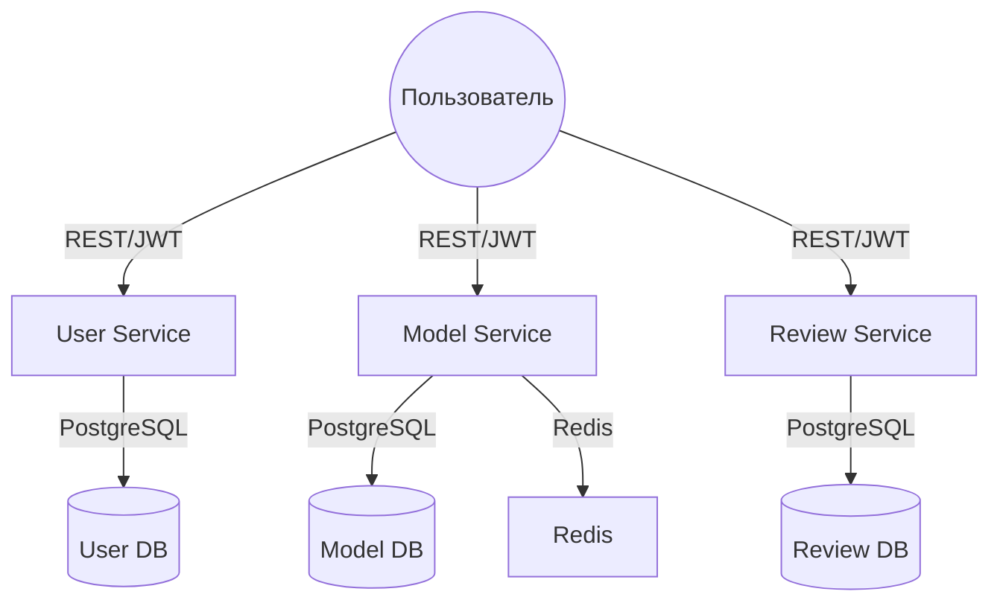

# 🧑‍💻 Архитектура проекта

## Микросервисная структура

Проект реализован в виде набора микросервисов, каждый из которых отвечает за свою бизнес-логику и имеет отдельную базу данных (PostgreSQL):

- **user-service** — сервис аутентификации, регистрации, управления пользователями и ролями (user/admin), JWT-авторизация, логирование входов/выходов/ошибок.
- **model-service** — сервис управления моделями обуви (CRUD, хранение информации о моделях, фото и т.д.).
- **review-service** — сервис отзывов: добавление, редактирование, удаление отзывов пользователями и админами.

Вспомогательные сервисы:
- **Redis** — кэширование фото моделей.

## Взаимодействие сервисов

- Все сервисы общаются через REST API.
- Для доступа к защищённым эндпоинтам используется JWT (выдаётся user-service).
- Каждый сервис имеет свою документацию (Swagger/OpenAPI).

## Схема взаимодействия

## Документация сервисов

- [User Service README](../../user-service/README.md)
- [Model Service README](../../model-service/README.md)
- [Review Service README](../../review-service/README.md)

## Развёртывание

Проект разворачивается через `docker-compose` (см. корневой README). Каждый сервис запускается в отдельном контейнере.

